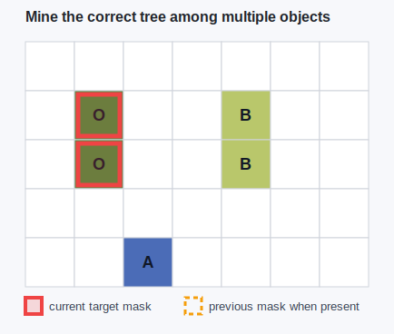
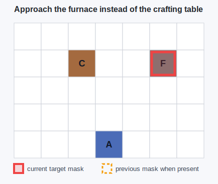
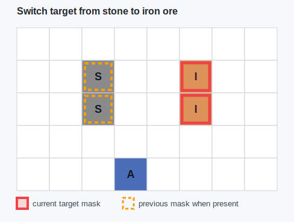
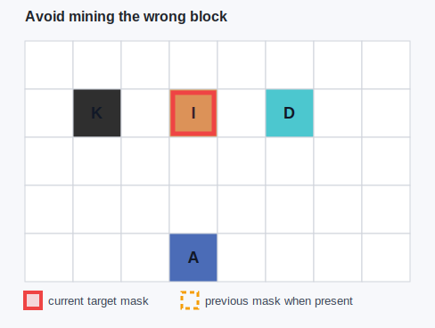
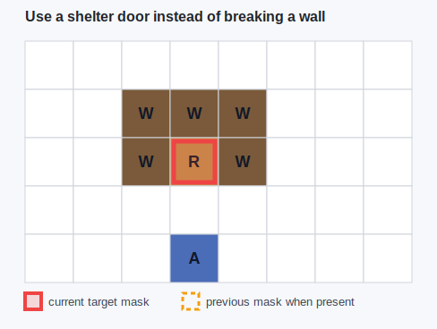

# Example Run

This log was generated by `visual_prompt_demo.py` using synthetic scenes.
It is a lightweight ROCKET-1-style visual prompt demo, not official inference.

## Mine the correct tree among multiple objects

- Scenario id: `correct_tree`
- Language-only instruction: Mine the tree.
- Ambiguity or failure risk: There are two visible trees, and language alone does not specify oak versus birch.
- Interaction type: `Mine`
- ROCKET-style object id: `2`
- Mask target: `oak tree` at cells `[[1, 1], [1, 2]]`
- Temporal context: Previous frame showed the cursor moving toward the left tree.

### ASCII Scene

Legend: `[X]` is the current mask; `(X)` is a previous mask.

```text
 .  .  .  .  .  .  .
 . [O] .  .  B  .  .
 . [O] .  .  B  .  .
 .  .  .  .  .  .  .
 .  .  A  .  .  .  .
```

### Visual Prompt Asset



### Why Visual-Temporal Context Helps

The mask fixes the spatial target while the interaction type says to mine rather than approach or use.

## Approach the furnace instead of the crafting table

- Scenario id: `furnace_not_table`
- Language-only instruction: Go to the station and use it.
- Ambiguity or failure risk: Both furnace and crafting table are valid stations, but only the furnace supports smelting.
- Interaction type: `Interact`
- ROCKET-style object id: `3`
- Mask target: `furnace` at cells `[[5, 1]]`
- Temporal context: Previous plan step was smelt iron ore, so the station should be the furnace.

### ASCII Scene

Legend: `[X]` is the current mask; `(X)` is a previous mask.

```text
 .  .  .  .  .  .  .
 .  .  C  .  . [F] .
 .  .  .  .  .  .  .
 .  .  .  .  .  .  .
 .  .  .  A  .  .  .
```

### Visual Prompt Asset



### Why Visual-Temporal Context Helps

The mask selects the furnace, and the interaction type indicates right-click/use instead of mining.

## Switch target from stone to iron ore

- Scenario id: `switch_stone_to_iron`
- Language-only instruction: Now mine the ore.
- Ambiguity or failure risk: The previous target was stone, so a policy may continue mining the old block if context is not updated.
- Interaction type: `Mine`
- ROCKET-style object id: `2`
- Mask target: `iron ore` at cells `[[5, 1], [5, 2]]`
- Temporal context: Previous mask was on stone; current mask moves to iron ore.

### ASCII Scene

Legend: `[X]` is the current mask; `(X)` is a previous mask.

```text
 .  .  .  .  .  .  .  .
 .  . (S) .  . [I] .  .
 .  . (S) .  . [I] .  .
 .  .  .  .  .  .  .  .
 .  .  .  A  .  .  .  .
```

### Visual Prompt Asset



### Why Visual-Temporal Context Helps

The temporal mask transition communicates target switching more directly than a short language update.

## Avoid mining the wrong block

- Scenario id: `avoid_wrong_block`
- Language-only instruction: Mine the useful ore.
- Ambiguity or failure risk: Coal, iron, and diamond are all useful, but the intended subgoal is iron for tool progression.
- Interaction type: `Mine`
- ROCKET-style object id: `2`
- Mask target: `iron ore` at cells `[[3, 1]]`
- Temporal context: Current plan says obtain iron ingot before returning to diamond.

### ASCII Scene

Legend: `[X]` is the current mask; `(X)` is a previous mask.

```text
 .  .  .  .  .  .  .  .
 .  K  . [I] .  D  .  .
 .  .  .  .  .  .  .  .
 .  .  .  .  .  .  .  .
 .  .  .  A  .  .  .  .
```

### Visual Prompt Asset



### Why Visual-Temporal Context Helps

The mask prevents a visually nearby but strategically wrong target from being selected.

## Use a shelter door instead of breaking a wall

- Scenario id: `door_not_wall`
- Language-only instruction: Get inside the shelter.
- Ambiguity or failure risk: A language-only policy may break a wall or path to the wrong cell instead of using the door.
- Interaction type: `Interact`
- ROCKET-style object id: `3`
- Mask target: `door` at cells `[[3, 2]]`
- Temporal context: The agent is outside at night and should preserve the shelter structure.

### ASCII Scene

Legend: `[X]` is the current mask; `(X)` is a previous mask.

```text
 .  .  .  .  .  .  .  .
 .  .  W  W  W  .  .  .
 .  .  W [R] W  .  .  .
 .  .  .  .  .  .  .  .
 .  .  .  A  .  .  .  .
```

### Visual Prompt Asset



### Why Visual-Temporal Context Helps

The door mask and use interaction encode both the correct object and the correct affordance.
